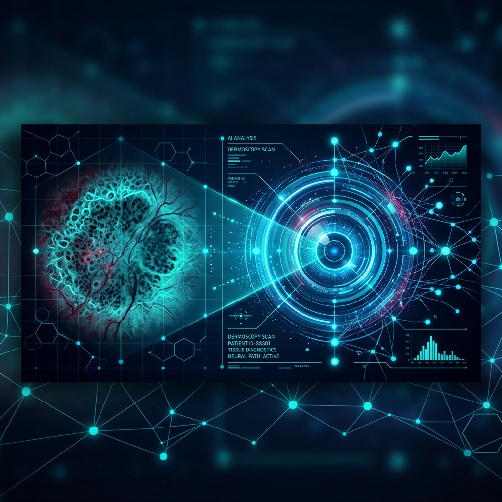
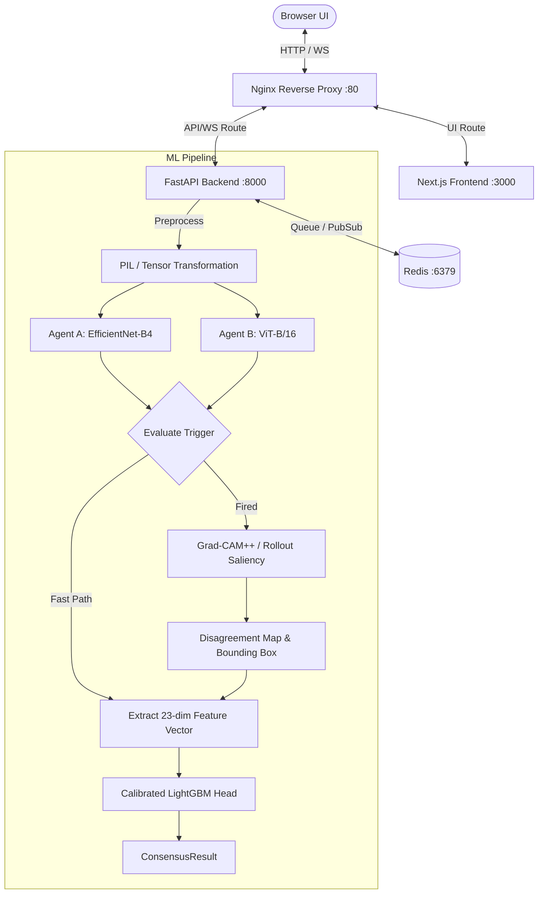

<div align="center">
  
  
  # 👁️ Argus Vision

  **Adversarial multi-agent visual debate for uncertainty-aware medical image classification**

  [](https://www.python.org/)
  [](https://fastapi.tiangolo.com/)
  [](https://nextjs.org/)
  [](https://pytorch.org/)
  [](https://lightgbm.readthedocs.io/)
  [](https://www.docker.com/)
  [](https://redis.io/)
  [](#)
</div>

---

**Argus Vision** classifies dermoscopic skin-lesion images into the **8 canonical ISIC categories** (MEL, NV, BCC, AK, BKL, DF, VASC, SCC). 

Medical vision classifiers are often overconfident or poorly calibrated near decision boundaries. Argus Vision solves this by deploying two independent classifier agents (a CNN and a Vision Transformer). When they disagree or exhibit high uncertainty, they trigger a spatial attention analysis. A calibrated **LightGBM consensus head** (with PyTorch MLP fallback) then fuses the agent predictions and spatial attention statistics to deliver a calibrated, uncertainty-aware final consensus prediction.

---

## ✨ Key Features

* 🤖 **Dual-Agent Core Classifier** — Parallel evaluation using a CNN backbone (**EfficientNet-B4**) and a Vision Transformer backbone (**ViT-B/16**) trained on the ISIC 2019 dataset.
* ⚡ **Intelligent Debate Trigger** — Monitors Jensen-Shannon divergence ($D_{JS}$) and predictive entropy ($H$) in real time. If they cross user-defined thresholds ($\tau_{JS} = 0.25$, $\tau_{H} = 0.8$ bits), the system triggers a deep attention visual debate; otherwise, it takes the fast-path.
* 🔍 **Interactive Saliency & Attention Mapping** — When the trigger fires, the pipeline computes Grad-CAM++ (Agent A) and Attention Rollout (Agent B) maps to localize a **contested bounding box** enclosing the highest spatial disagreement.
* 🎯 **Calibrated LightGBM Consensus Head** — Replaces unstable MLPs with a 23-dimensional numerical fusion head trained using 5-Fold Stratified Cross-Validation and Isotonic calibration, achieving low Expected Calibration Error (ECE) and high precision (especially on rare SCC and MEL classes).
* 🐳 **Full-Stack Docker Orchestration** — Seamless containerization of Next.js frontend, FastAPI backend, Redis job queue, and Nginx reverse proxy.

---

## 🗺️ System Topology



---

## 📂 Repository Map

Below is a map of the primary modules. Click any file or folder to jump directly to its implementation.

* 📂 [backend/](backend/) — FastAPI backend orchestrating the ML jobs.
  * 📂 [api/](backend/api/) — REST and WebSocket endpoints.
    * 📄 [routes/classify.py](backend/api/routes/classify.py) — Image upload & job queue dispatcher.
    * 📄 [websocket/debate_stream.py](backend/api/websocket/debate_stream.py) — Live progress and attention relay.
  * 📂 [core/](backend/core/) — Configuration settings and Pydantic models.
  * 📂 [ml/](backend/ml/) — Core machine learning logic.
    * 📂 [agents/](backend/ml/agents/) — EfficientNet-B4 and ViT-B/16 loader classes.
    * 📂 [attention/](backend/ml/attention/) — Grad-CAM++, Attention Rollout, and disagreement bounding box logic.
    * 📂 [consensus/](backend/ml/consensus/) — Calibrated consensus classifier (LightGBM/MLP).
    * 📂 [debate/](backend/ml/debate/) — Debate triggers and 23-dim numerical feature extractor.
* 📂 [frontend/](frontend/) — Next.js single-page application.
* 📂 [ml_training/](ml_training/) — Training notebooks and offline calibration scripts.
  - 📄 [01_train_agent_a.ipynb](ml_training/01_train_agent_a.ipynb) — Agent A training script (Kaggle).
  - 📄 [02_train_agent_b.ipynb](ml_training/02_train_agent_b.ipynb) — Agent B training script (Kaggle).
  - 📄 [03_build_hard_subset.ipynb](ml_training/03_build_hard_subset.ipynb) — Mined training disagreement subset.
  - 📄 [04_train_consensus.ipynb](ml_training/04_train_consensus.ipynb) — LightGBM consensus head Stratified 5-Fold training.
  - 📄 [05_evaluation.ipynb](ml_training/05_evaluation.ipynb) — Full model evaluation & calibration checks.
  - 📄 [KAGGLE_TRAINING.md](ml_training/KAGGLE_TRAINING.md) — Step-by-step training pipeline walkthrough.
* 📄 [docker-compose.yml](docker-compose.yml) — Orchestration of services.

---

## ⚡ Quick Start

### Requirements
* **Docker Engine** (with Compose plugin v2.24+)
* Internet connection (first run downloads and caches pretrained weights in the `hf-cache` volume).

### Running the App
1. **Clone the repository and build the container stack:**
   ```bash
   docker compose up --build
   ```
2. **Access the Web Dashboard:**
   Open **`http://localhost`** in your browser.

*Note: The first run downloads ~1 GB of model weights and may take a few minutes. Subsequent launches are near-instant as they utilize the Docker volume.*

---

## 🧪 Training & Calibration Pipeline

Predictions are not clinically meaningful until trained on the ISIC 2019 dataset. You can train the entire pipeline on a free Kaggle GPU using the provided notebooks.

Refer to the **[Kaggle Training Guide](ml_training/KAGGLE_TRAINING.md)** for detailed instructions on adding datasets, setting up secrets, and running the cells.

### The 23-Dimensional Numerical Contract
To ensure high-throughput training and low latency during inference, the consensus head consumes a 23-dimensional numerical feature vector:

| Indices | Name | Description |
| :--- | :--- | :--- |
| **0 – 7** | `pA` | Softmax probability distribution of Agent A over the 8 classes. |
| **8 – 15** | `pB` | Softmax probability distribution of Agent B over the 8 classes. |
| **16** | `js_div` | Jensen-Shannon divergence ($D_{JS}$) between `pA` and `pB`. |
| **17** | `entropy_a` | Shannon entropy of `pA` (in bits). |
| **18** | `entropy_b` | Shannon entropy of `pB` (in bits). |
| **19** | `max_prob_delta` | Maximum absolute class difference $\max |pA - pB|$. |
| **20** | `attn_iou` | Intersection over Union (IoU) of the two attention maps thresholded at 0.5. |
| **21** | `attn_entropy_a` | Shannon entropy of Agent A's normalized spatial attention map. |
| **22** | `attn_entropy_b` | Shannon entropy of Agent B's normalized spatial attention map. |

---

## ⚙️ Environment Variables

### Backend Configuration (`backend/.env`)

| Variable | Description | Default |
| :--- | :--- | :--- |
| `REDIS_URL` | Redis URL for task queue and WebSocket Pub/Sub | `redis://redis:6379` |
| `MODEL_CHECKPOINT_DIR` | Directory holding model weight checkpoints | `./checkpoints` |
| `AGENT_A_CHECKPOINT` | Agent A weight filename | `agent_a_best.pth` |
| `AGENT_B_CHECKPOINT` | Agent B weight filename | `agent_b_best.pth` |
| `CONSENSUS_CHECKPOINT` | Consensus PyTorch fallback checkpoint | `consensus_best.pth` |
| `CONSENSUS_SCALER` | Standard scaler checkpoint | `consensus_scaler.pkl` |
| `PRETRAINED_FALLBACK` | Fallback to ImageNet if checkpoints are missing | `True` |
| `DEBATE_JS_THRESHOLD` | Threshold JS divergence to trigger debate/attention | `0.25` |
| `DEBATE_ENTROPY_THRESHOLD` | Threshold Shannon entropy to trigger debate/attention | `0.8` |
| `MAX_IMAGE_SIZE_MB` | Maximum allowed image upload size in MB | `10` |
| `ALLOWED_ORIGINS` | Permitted CORS origins | `http://localhost:3000,http://localhost` |

### Frontend Configuration (Environment / Build Args)

| Variable | Description | Default |
| :--- | :--- | :--- |
| `NEXT_PUBLIC_API_URL` | HTTP API base URL | `http://localhost/api` |
| `NEXT_PUBLIC_WS_URL` | WebSocket debate URL | `ws://localhost/ws` |

---

## ⚖️ License
This project is licensed under the MIT License.
