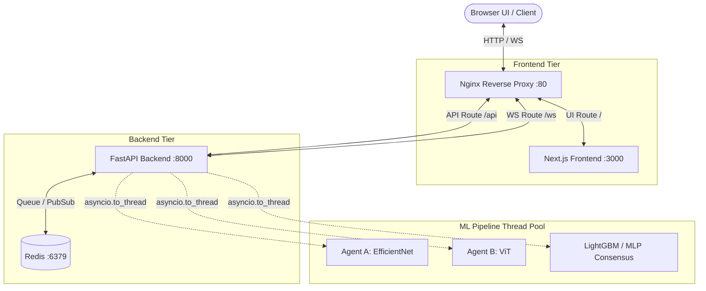
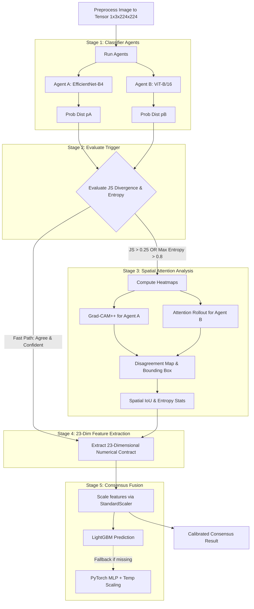

# Argus Vision Project Context

This file serves as the definitive, encyclopedic reference for the **Argus Vision** project. It provides a comprehensive, deep-dive context covering the architecture, module behavior, exact machine learning pipeline mechanics, internal data schemas, API contracts, WebSocket protocols, and repository structure. It is expressly designed to give an AI agent or a senior developer the *complete context* from the macro system topography down to the micro-level implementation details required to develop, debug, and maintain this system.

> [!WARNING]
> Previous versions of this system used a natural language LLM debate (via Groq) and sentence embeddings. **This has been completely refactored.** The system now relies entirely on a deterministic, highly calibrated **23-dimensional numerical consensus contract** and a LightGBM fusion head. There is no longer an active LLM step, but certain Pydantic schemas (e.g., `ArgumentResult`) remain historically in `core/models.py` for backward compatibility with old database jobs.

---

## 1. Project Overview & Clinical Goal

**Argus Vision** is a cutting-edge medical image classification platform designed to diagnose dermoscopic skin-lesion images into one of the 8 canonical **ISIC (International Skin Imaging Collaboration)** categories. 

| Index | Code | Diagnosis Name | Clinical Summary & Dermoscopic Criteria |
| :--- | :--- | :--- | :--- |
| **0** | **MEL** | Melanoma | Atypical, broadened pigment network; irregular streaks; structural/colour asymmetry; regression areas; blue-white veil; irregular dots/globules; chaotic vessels. |
| **1** | **NV** | Melanocytic Nevus | Symmetric, regular reticular or globular pattern; uniform colouration; smooth transition to surrounding skin; center-symmetric structure; no chaotic borders. |
| **2** | **BCC** | Basal Cell Carcinoma | Arborising (tree-like branching) vessels; blue-grey ovoid nests; pigment-network-free background; leaf-like areas; spoke-wheel structures; shiny white-red structureless zones. |
| **3** | **AK** | Actinic Keratosis | 'Strawberry' pattern on facial skin; red pseudo-network of dilated vessels; white rosettes under polarised light; scaly background. |
| **4** | **BKL** | Benign Keratosis | Seborrhoeic/lichenoid keratosis; cerebriform 'brain-like' surface; milia-like cysts; comedo-like openings; sharply demarcated borders. |
| **5** | **DF** | Dermatofibroma | Central white scar-like patch; peripheral delicate pigment network; firm tan-brown ring; central dimpling on lateral compression. |
| **6** | **VASC** | Vascular Lesion | Haemangiomas/angiokeratomas; sharply demarcated red, purple, or maroon lacunae separated by pale septa; absence of melanocytic pigment network. |
| **7** | **SCC** | Squamous Cell Carcinoma | Central keratin masses; white circles around follicular openings; surface scale/ulceration; peripheral hairpin/looped and glomerular/coiled vessels. |

Rather than relying on a single vision classifier (which might be overconfident or poorly calibrated near decision boundaries), Argus Vision uses an **Adversarial Dual-Agent Architecture** with an **Intelligent Debate Trigger** and a **Calibrated Consensus Head**:
1. **Two distinct model backbones** (a CNN and a Vision Transformer) analyze the image independently.
2. If they disagree or exhibit high entropy (uncertainty), they trigger a spatial attention analysis.
3. A calibrated **LightGBM consensus head** (with PyTorch MLP fallback) fuses the agents' probability vectors, spatial region statistics, and trigger divergences into a 23-dimensional numerical vector to yield the final, calibrated prediction.

---

## 2. Architecture & System Topography

Argus Vision operates as a full-stack orchestrated environment. 

### Network Topology Diagram



### Microservice Roles
1. **Nginx (Port 80):** Operates as the entry reverse proxy. It routes `/api/*` to the FastAPI backend, `/ws/*` to the FastAPI WebSocket endpoints, and all other traffic `/` to the Next.js frontend.
2. **Frontend (Port 3000):** A Next.js application that provides the image upload dropzone interface and renders the real-time websocket pipeline events (heatmaps, confidence bars, bounding boxes).
3. **Backend (Port 8000):** A FastAPI app that exposes REST endpoints for image upload/polling, and WebSocket endpoints for streaming inference progress. All blocking ML inference is offloaded to worker threads via `asyncio.to_thread`.
4. **Redis (Port 6379):** The central database and real-time message broker:
    *   Saves job metadata (`JobResult` JSON string) under the key `argus:job:{job_id}`.
    *   Saves the raw uploaded image path under `argus:img:{job_id}`.
    *   Streams real-time pipeline steps to connected UI clients over pub/sub channels named `argus:debate:{job_id}`.

---

## 3. The End-to-End Machine Learning Pipeline (Micro-Level)

The entire ML execution is defined in `backend/ml/pipeline.py` via the `DebatePipeline` orchestrator.

### Pipeline Execution Flow



### 3.1. Stage 1: Classifier Agents
*   **Agent A (`backend/ml/agents/agent_a.py`):** Wraps `timm` model `efficientnet_b4`. It processes a pre-processed `(1, 3, 224, 224)` image tensor normalized with ImageNet stats.
*   **Agent B (`backend/ml/agents/agent_b.py`):** Wraps `timm` model `vit_base_patch16_224.augreg_in21k_ft_in1k`.
*   Both models load checkpoints (`agent_a_best.pth` and `agent_b_best.pth`). If missing, they use `PRETRAINED_FALLBACK` to fall back to ImageNet weights (which allows system testing, though it yields random clinical predictions).

### 3.2. Stage 2: Debate Trigger
Determines if the image requires deep spatial analysis. Calculated in `backend/ml/debate/trigger.py`.
*   **Jensen-Shannon Divergence ($D_{JS}$):** The square of the JS distance between $p_A$ and $p_B$ using base-2 logarithm.
*   **Shannon Entropy ($H$):** Measures uncertainty of $p_A$ and $p_B$ in bits.
*   **Thresholds:** Trigger fires if $D_{JS} > 0.25$ OR $\max(H(p_A), H(p_B)) > 0.8$.

### 3.3. Stage 3: Spatial Attention Analysis
Calculated if the trigger fires.
*   **Grad-CAM++:** Extracted from Agent A's final convolutional layer.
*   **Attention Rollout:** Traces self-attention weights across Agent B's transformer layers.
*   **Disagreement Map ($M_{\delta}$):** Absolute difference of independently min-max normalized attention maps.
*   **Bounding Box:** Drawn around the top 20% highest activated pixels of the combined normalized map.

### 3.4. Stage 4: The 23-Dimensional Feature Contract
Extracted in `backend/ml/debate/features.py`. This is the strict numerical vector passed to the consensus head.

| Indices | Name | Description |
| :--- | :--- | :--- |
| **0 – 7** | `pA` | Softmax probability distribution of Agent A over the 8 classes. |
| **8 – 15** | `pB` | Softmax probability distribution of Agent B over the 8 classes. |
| **16** | `js_div` | Jensen-Shannon divergence ($D_{JS}$) between `pA` and `pB`. |
| **17** | `entropy_a` | Shannon entropy of `pA` (in bits). |
| **18** | `entropy_b` | Shannon entropy of `pB` (in bits). |
| **19** | `max_prob_delta` | Maximum absolute class difference $\max \|pA - pB\|$. |
| **20** | `attn_iou` | Intersection over Union (IoU) of the two attention maps thresholded at 0.5. |
| **21** | `attn_entropy_a` | Shannon entropy of Agent A's normalized spatial attention map. |
| **22** | `attn_entropy_b` | Shannon entropy of Agent B's normalized spatial attention map. |

*Note: If the trigger does NOT fire (the fast path), `attn_iou`, `attn_entropy_a`, and `attn_entropy_b` are set to `0.0`.*

### 3.5. Stage 5: Consensus Classifier MLP & Calibration
Located in `backend/ml/consensus/classifier.py`.
1.  **StandardScaler:** The 23-d vector is standardized `(x - mean) / scale` using `consensus_scaler.pkl` (with `consensus_scaler.json` as a numpy fallback).
2.  **LightGBM Fusion:** The system attempts to load `consensus_lgbm.pkl`. Tree-based gradient boosting yields exceptionally well-calibrated probabilities on these 23 tabular features.
3.  **PyTorch MLP Fallback:** If LightGBM is absent, the system uses a PyTorch MLP (`Linear(23, 128) -> ReLU -> Linear(128, 64) -> ReLU -> Linear(64, 8)`). The output logits are divided by a learnable temperature scalar $\sigma$ (min bounded at $10^{-2}$) before Softmax.
4.  **ECE (Expected Calibration Error):** Emitted natively alongside the consensus to indicate statistical reliability to the frontend.

---

## 4. API Contracts & JSON Payloads (core/models.py)

The backend and frontend strictly adhere to Pydantic-defined JSON contracts.

### 4.1 REST API

**`POST /api/classify`**
*   **Input:** `multipart/form-data` with a `file` field.
*   **Output:** `{"job_id": "uuid", "status": "queued", "estimated_seconds": 10}`

**`GET /api/jobs/{job_id}`**
Returns the entire JobResult state document.
```json
{
  "job_id": "8bc5a0e0-47b2-4d2d-8068-07e15bf9ec2d",
  "status": "consensus_done",
  "created_at": "2026-06-18T14:40:00Z",
  "updated_at": "2026-06-18T14:40:10Z",
  "agent_a": {
    "agent_id": "A",
    "result": {
      "pred_class": "MEL",
      "confidence": 0.72,
      "probabilities": { "MEL": 0.72, "NV": 0.10 }
    },
    "heatmap_b64": "data:image/png;base64,..."
  },
  "agent_b": {
    "agent_id": "B",
    "result": {
      "pred_class": "BKL",
      "confidence": 0.61,
      "probabilities": { "MEL": 0.05, "BKL": 0.61 }
    },
    "heatmap_b64": "data:image/png;base64,..."
  },
  "trigger": {
    "fired": true,
    "js_divergence": 0.38,
    "entropy_a": 0.95,
    "entropy_b": 1.12,
    "threshold_js": 0.25,
    "threshold_entropy": 0.8
  },
  "attention": {
    "heatmap_a_b64": "data:image/png;base64,...",
    "heatmap_b_b64": "data:image/png;base64,...",
    "disagreement_b64": "data:image/png;base64,...",
    "bbox": { "x1": 42, "y1": 30, "x2": 150, "y2": 180 },
    "region_stats_a": { "mean": 0.58, "std": 0.12 },
    "region_stats_b": { "mean": 0.41, "std": 0.19 }
  },
  "consensus": {
    "pred_class": "MEL",
    "confidence": 0.79,
    "probabilities": { "MEL": 0.79, "NV": 0.05 },
    "temperature": 1.15,
    "ece": 0.042
  },
  "error": null
}
```

### 4.2 WebSocket Event Protocol (`WS /ws/debate/{job_id}`)
Managed in `backend/api/websocket/debate_stream.py`. Clients receive a Discriminated Union of JSON messages categorized by the `type` field.
*   **`{"type": "ping"}`**: Sent every 30s as a keepalive.
*   **`{"type": "agents_running"}`**: Emitted when agents start.
*   **`{"type": "agents_done", "agent_a": {...}, "agent_b": {...}}`**: Fired when CNN and ViT complete inference.
*   **`{"type": "trigger_evaluated", "result": {...}}`**: Contains the JS/Entropy calculation.
*   **`{"type": "attention_computed", "result": {...}}`**: Emitted when Grad-CAM++ and Rollout base64 maps are generated.
*   **`{"type": "consensus_done", "result": {...}}`**: Final calibrated result.
*   **`{"type": "error", "message": "..."}`**: Emitted on pipeline failure.

*(Note: Although models like `ArgumentTokenEvent` exist in `core/models.py` for legacy compatibility, they are no longer emitted by `pipeline.py`.)*

---

## 5. File Structure & Complete Directory Map

A comprehensive mapping of the repository layout:

```text
argus-vision/
├── backend/                  # FastAPI Application Core
│   ├── api/
│   │   ├── routes/
│   │   │   ├── classify.py   # POST /classify (image upload handler)
│   │   │   ├── health.py     # GET /health (healthcheck endpoint)
│   │   │   └── jobs.py       # GET /jobs/{jobId} (results retrieval)
│   │   └── websocket/
│   │       └── debate_stream.py # WS /ws/debate/{jobId} (Redis pub/sub consumer)
│   ├── checkpoints/          # Model weights directory
│   │   ├── agent_a_best.pth  # EfficientNet-B4 weights
│   │   ├── agent_b_best.pth  # ViT-B/16 weights
│   │   ├── consensus_lgbm.pkl# Primary LightGBM consensus head (scikit-learn 1.6.1)
│   │   ├── consensus_lgbm.json# Hyperparameter metadata & metrics
│   │   ├── consensus_scaler.pkl # StandardScaler parameters (scikit-learn 1.6.1)
│   │   └── consensus_scaler.json # StandardScaler fallback config
│   ├── core/
│   │   ├── config.py         # pydantic-settings config mapper
│   │   ├── exceptions.py     # Custom error hierarchy
│   │   └── models.py         # Pydantic schemas (JobResult, DebateEvent, etc.)
│   ├── ml/
│   │   ├── agents/
│   │   │   ├── agent_a.py    # CNN wrapper (EfficientNet-B4)
│   │   │   └── agent_b.py    # ViT wrapper (ViT-B/16)
│   │   ├── attention/
│   │   │   ├── disagreement.py# Disagreement map & bbox mask extraction
│   │   │   ├── gradcam.py    # Grad-CAM++ logic (Agent A)
│   │   │   └── rollout.py    # Transformer Attention Rollout logic (Agent B)
│   │   ├── consensus/
│   │   │   └── classifier.py # Calibrated Fusion logic (StandardScaler -> LGBM/MLP)
│   │   ├── debate/
│   │   │   ├── features.py   # The 23-dimensional vector extractor
│   │   │   └── trigger.py    # JS Divergence & Shannon Entropy evaluation
│   │   └── pipeline.py       # The End-to-End Orchestrator class
│   ├── services/
│   │   ├── image_service.py  # Tensor preprocessing and Base64 heatmap rendering
│   │   └── job_service.py    # Redis persistence and PubSub message dispatcher
│   ├── main.py               # FastAPI entrypoint and lifespan definition
│   ├── Dockerfile
│   └── requirements.txt
│
├── frontend/                 # Next.js Application Core
│   ├── src/
│   │   ├── app/
│   │   │   ├── debate/
│   │   │   │   └── [jobId]/
│   │   │   │       └── page.tsx # WebSocket subscriber & dynamic debate viewer
│   │   │   ├── globals.css   # Main stylesheet (Tailwind)
│   │   │   ├── layout.tsx    # Root HTML layout
│   │   │   └── page.tsx      # Landing page with DropZone file uploader
│   │   ├── components/
│   │   │   ├── debate/
│   │   │   │   ├── AgentScoreboard.tsx  # Dynamic side-by-side agent beliefs
│   │   │   │   ├── ConsensusVerdict.tsx # Displays final consensus output
│   │   │   │   ├── DebateTranscript.tsx # Renders structured interactive debate turns
│   │   │   │   ├── DisagreementMap.tsx  # Visual disagreement map overlay
│   │   │   │   ├── HeatmapCanvas.tsx    # Canvas overlays for base64 images & bbox
│   │   │   │   ├── ProbabilityBars.tsx  # Renders live-updating belief bars
│   │   │   │   ├── TimelineRail.tsx     # Visual progress track of debate rounds
│   │   │   │   ├── TriggerPanel.tsx     # Displays trigger metrics (D_JS, Entropy)
│   │   │   │   ├── VSDivider.tsx        # Styled central VS badge
│   │   │   │   └── WebGLBackground.tsx  # Visual particle backdrop
│   │   │   └── upload/
│   │   │       └── DropZone.tsx         # File drag-and-drop
│   │   ├── hooks/
│   │   │   ├── useCountup.ts            # Animation hook for percentages
│   │   │   ├── useDebateEngine.ts       # React wrapper around client-side debate
│   │   │   └── useDebateStream.ts       # WebSocket/stream connector
│   │   ├── lib/
│   │   │   ├── debate/                  # Client-Side Debate Engine
│   │   │   │   ├── argumentBank.ts      # Clinical statements categorized by move
│   │   │   │   ├── beliefs.ts           # Log opinion pool belief updater
│   │   │   │   ├── embedder.ts          # CDN-based MiniLM embedding extractor
│   │   │   │   ├── engine.ts            # Client-side turn-taking state machine
│   │   │   │   └── retrieval.ts         # Vector semantic retrieval engine
│   │   │   ├── constants.ts
│   │   │   ├── debateReducer.ts
│   │   │   ├── sessionImage.ts
│   │   │   └── webgl-particles.ts
│   │   ├── types/            # TypeScript interfaces mirroring core/models.py
│   ├── Dockerfile
│   ├── tailwind.config.ts
│   └── package.json
│
├── ml_training/              # Research, Training & Calibration Notebooks
│   ├── 01_train_agent_a.ipynb   # Train EfficientNet-B4
│   ├── 02_train_agent_b.ipynb   # Train ViT-B/16
│   ├── 03_build_hard_subset.ipynb# Create boundary datasets based on JS divergence
│   ├── 04_train_consensus.ipynb # Train LightGBM/MLP on the 23-dim feature vector
│   ├── 05_evaluation.ipynb      # Global calibration/ECE metrics plotting
│   ├── dataset.py            # PyTorch dataloaders
│   └── debate_text_utils.py  # Original source of the 23-dim feature extraction logic
│
├── nginx/
│   └── nginx.conf            # Proxy routing configuration for port 80
│
└── docker-compose.yml        # Orchestrates the microservice cluster
```

---

## 6. Environment Configurations

All primary configuration is injected via `.env` files or `docker-compose` environment mappings.

### Backend (`backend/.env` or Docker env)

| Variable | Type | Default | Description |
| :--- | :--- | :--- | :--- |
| `REDIS_URL` | string | `redis://redis:6379` | Redis server address for job queue and pub/sub. |
| `MODEL_CHECKPOINT_DIR`| string | `./checkpoints` | Path to weights checkpoints. |
| `AGENT_A_CHECKPOINT` | string | `agent_a_best.pth` | Agent A weight file. |
| `AGENT_B_CHECKPOINT` | string | `agent_b_best.pth` | Agent B weight file. |
| `CONSENSUS_CHECKPOINT`| string | `consensus_best.pth`| Consensus MLP weight file fallback. |
| `CONSENSUS_SCALER` | string | `consensus_scaler.pkl` | StandardScaler joblib/JSON parameters. |
| `PRETRAINED_FALLBACK` | boolean| `True` | Fall back to ImageNet weights if checkpoints are missing (prevents crashes when no weights exist). |
| `DEBATE_JS_THRESHOLD` | float | `0.25` | JS divergence trigger threshold. |
| `DEBATE_ENTROPY_THRESHOLD`| float | `0.8` | Shannon entropy trigger threshold. |
| `MAX_IMAGE_SIZE_MB` | integer| `10` | Maximum file size allowed in uploads. |
| `ALLOWED_ORIGINS` | string | `http://localhost:3000,http://localhost` | Permitted CORS origins for FastAPI. |

### Frontend Settings

| Variable | Type | Default | Description |
| :--- | :--- | :--- | :--- |
| `NEXT_PUBLIC_API_URL` | string | `http://localhost/api` | Base URL for REST endpoints. Inside Docker, this points to Nginx. |
| `NEXT_PUBLIC_WS_URL` | string | `ws://localhost/ws` | Base URL for WebSocket endpoints. Inside Docker, this points to Nginx. |
| `NEXT_PUBLIC_DEBATE_EMBEDDER` | string | `transformers` | Embedder type. Set to `transformers` for MiniLM (384-d) via CDN, or fallback to lexical retrieval. |

---

## 7. Client-Side Mock Debate Engine

Since the removal of Groq LLM logic from the backend, the visual turn-by-turn debate transcript is generated dynamically and client-side inside the frontend React application (`frontend/src/lib/debate/`).

### 7.1. Belief Revision (Reasoning)
In each round, the speaking agent updates its probability distribution using a **confidence-weighted logarithmic opinion pool** targeting a shared agreement distribution:
*   The less confident agent yields more (natural concession).
*   The target distribution absorbs spatial evidence (IoU, region statistics) and converges toward the final calibrated consensus result returned by the backend.
*   This process provably contracts the Jensen-Shannon divergence between the agents until it falls below the convergence threshold, triggering a closing handshake.

### 7.2. Turn-Taking State Machine
Managed by `engine.ts`, the debate loop steps through a sequence:
1.  **Openers (R1):** Agent A presents its primary class. Agent B responds with its leading class.
2.  **Rebuttals (R2-R5):** Speaking agent rebuts by highlighting features of its preferred class or questioning the opponent's read.
3.  **Softening/Conceding:** If an agent's confidence drops significantly below the opponent's, it changes its move to `softens` or `concedes`.
4.  **Agreement/Handshake (R6/Convergence):** Once divergence drops below the threshold, both agents align on the `agrees` move.
5.  **Safety Cap:** Loop terminates after a maximum of 18 rounds to prevent infinite loops. Paced at 4–11s per turn for user readability.

### 7.3. Offline Embedding Retrieval
Clinical arguments are retrieved from a predefined statement bank (`argumentBank.ts`) by semantic similarity to the active debate context:
*   By default, it uses lexical search.
*   If `NEXT_PUBLIC_DEBATE_EMBEDDER=transformers` is set, it downloads a lightweight `all-MiniLM-L6-v2` (384-dim) model from a CDN at runtime, executing vector semantic retrieval directly in the browser's worker threads.

---

## 8. Known Issues & Limitations

### 8.1. Minority Class Misclassification (VASC, SCC, AK)
Both Agent A (EfficientNet-B4) and Agent B (ViT-B/16) exhibit poor sensitivity on minority classes, specifically **VASC (Vascular Lesions)**, which they frequently misclassify as **DF (Dermatofibroma)**. 
*   **Cause:** Extreme class imbalance in the training data (e.g., ISIC-2018 is 66.7% NV vs only 1.1% DF and 1.4% VASC). Standard cross-entropy loss trained on this distribution forces the backbones to ignore minority classes.
*   **Resolution Plan:** Retraining models using Focal Loss or Class-Balanced loss, oversampling VASC/SCC inputs, or upgrading to modern medical-imaging pre-trained backbones (e.g., ConvNeXt-V2 or EVA-02).

### 8.2. scikit-learn Version Mismatch
The trained `consensus_lgbm.pkl` and `consensus_scaler.pkl` checkpoints were created using `scikit-learn==1.6.1`. 
*   **Issue:** The default Docker backend environment used `scikit-learn==1.5.0`. This difference triggers serialization warnings and can silently corrupt `IsotonicRegression` calibrators wrapped inside `CalibratedClassifierCV` during unpickling.
*   **Resolution:** The Docker container's python environment is patched at runtime to install `scikit-learn==1.6.1` to align with the training environment.

---

## 9. Running & Deployment

### 9.1. Docker Compose (Full Stack)
The recommended way to boot the ecosystem:
```bash
docker compose up --build
```
*   The application binds to `localhost:80`.
*   A `hf-cache` Docker volume persists pretrained backbone weights downloaded via `timm` during the first run to accelerate subsequent boots.

### 9.2. Local Development Run
If debugging specific microservices locally:

**Backend:**
```bash
cd backend
pip install -r requirements.txt
uvicorn main:app --host 0.0.0.0 --port 8000 --reload
```
*(Requires a local Redis server running on port 6379).*

**Frontend:**
```bash
cd frontend
npm install
npm run dev
```
*(Runs on `localhost:3000` and needs `NEXT_PUBLIC_API_URL` pointing to the dev backend).*

---

### End of Document
This `context.md` acts as the authoritative truth for Argus Vision. AI Agents modifying the code must abide strictly by the 23-dimensional feature contract, ensure WebSocket event compliance, and never inject legacy LLM logic back into the pipeline orchestrator.
